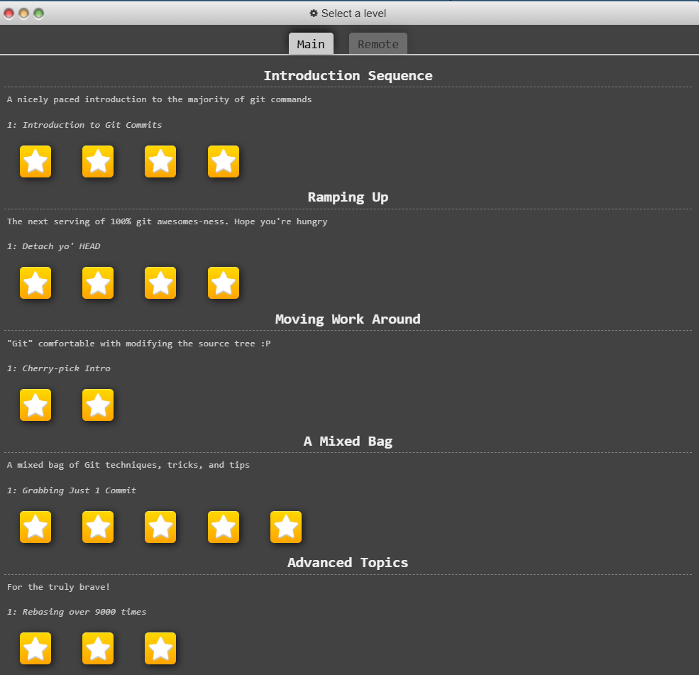

# https://learngitbranching.js.org/
- [url](https://learngitbranching.js.org/)

```bash
help
help level
reset
clear
show goal
show solution
```



# https://git-school.github.io/visualizing-git/
- [url](https://git-school.github.io/visualizing-git/)

```bash
help
undo
redo
pres()
```
